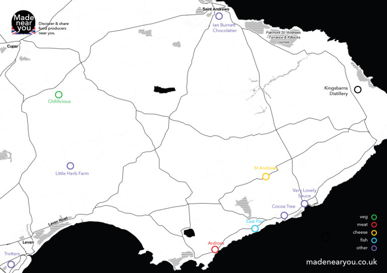
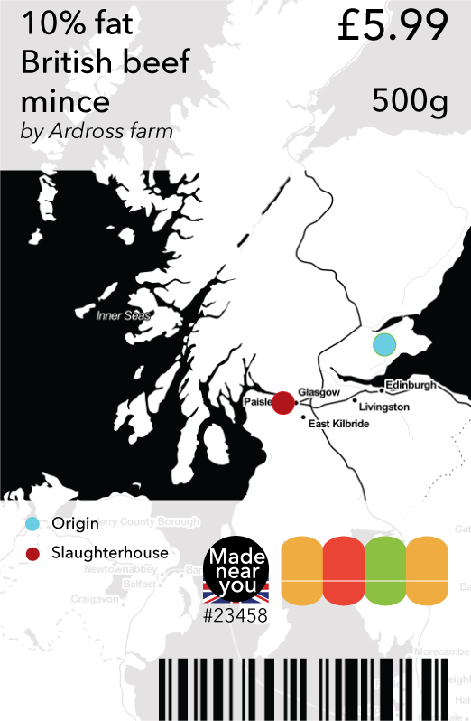

# Made Near You

### This project includes labels, a map and a website. The labels aim to show consumers in a visual way how far away their food has come from and where it has been processed. The map and website allow you to enter your postcode to generate an easy-to-print map of local food producers who sell to the public.

*By Alexandra Deschamps-Sonsino

Read more: [http://designswarm.com/blog/2016/06/made-near-you-making-local-food-businesses-shareable-transparent/](http://designswarm.com/blog/2016/06/made-near-you-making-local-food-businesses-shareable-transparent/)
